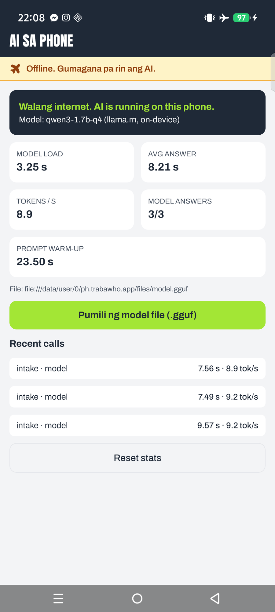

# TrabaWho

**On-device AI for booking blue-collar home services in the Philippines, built to keep working when the signal doesn't.**

TrabaWho is a Grab-style booking app for plumbers, electricians, carpenters, aircon technicians and welders. A client describes the problem in their own Taglish ("Ayaw gumana ng saksakan sa kusina, nag-spark kanina"), and a **language model running on the phone** turns it into a bookable job: the right service, task, urgency, hazards and a short summary. Workers dictate what they did after a job, and the same on-device model turns it into an itemized report. **All AI runs on the phone, in airplane mode.** Bookings and reports queue offline and sync when the connection comes back.

> AppBuildersPH Hackathon 2026 · Theme: **Local AI** · "Build an AI product that remains genuinely useful when the cloud disappears."

---

## Why local AI?

Home-repair problems happen where signal fails: a sparking outlet during a brownout, a leak at night with no load, a worker inside a basement or ceiling. TrabaWho's AI runs entirely on the user's phone. It turns a messy Taglish description into a bookable job and writes the worker's job report **without data, at no load cost, and without sending descriptions or photos of the inside of someone's home to a server**. Only the booking the client approved and the finished report are synced when the connection returns.

## What runs locally vs what needs internet

| Runs on the phone (works in airplane mode) | Needs internet |
| --- | --- |
| Job intake: Taglish text → service, task, urgency, hazards, summary (LLM) | Sending / syncing bookings and reports |
| Job report: worker's text → tasks, materials, quantities, duration (LLM) | Worker matching and accepting jobs |
| Price and duration estimates (bundled catalog) | Booking status updates |
| Safety notes for hazards (pre-written, never AI-generated) | First-time install of the app and model |
| **Anti-scam check** of pasted chat/SMS messages (LLM + rules); the message never leaves the phone | |
| **First-aid chatbot** "habang hinihintay": AI understands the problem, shows team-written safe steps | |
| Keyword fallback if the model fails | |
| Offline booking / report queue | |

**No cloud AI API is used anywhere.**

## How the AI works

```
client text ─► prompt (catalog of task codes + Taglish few-shot examples)
            ─► Qwen3 1.7B on the phone (llama.rn), JSON-schema constrained output
            ─► Zod validation ─► retry once ─► keyword fallback if still invalid
            ─► rules engine (plain code): urgency floors from hazards, price/duration
               from the catalog, pre-written safety notes, follow-up questions
            ─► Booking Card (client can edit before booking)
```

Design rules that keep a 1.7B model safe and useful:
- **The model only chooses; code decides.** The model picks codes from a fixed list and writes a one-line summary. Prices, durations, safety text and questions come from a bundled catalog.
- **Safety can't depend on the model.** Hazard keywords in the original text are always checked by code. A gas smell always shows the evacuation note and 911, whatever the model returns.
- **Code does the arithmetic.** Report durations ("isang oras at kalahati" = 90 min) and totals are computed by code; the worker types material prices, never the AI.
- **The same pipeline everywhere.** Phone (llama.rn), laptop (Ollama) and the eval script share one code path in `packages/shared`.

### Safety features built on the same on-device model

**Suriin ang mensahe (anti-scam).** Paste a message from a worker or client (SMS, Messenger). The model flags warning signs: payment outside the app (GCash, Maya, bank), deposit before arriving, pressure to cancel the booking or leave the app, asking for an OTP or password, suspicious links, rushing, sudden price changes. Code also checks keywords, decides the risk (high / medium / low) and shows team-written warnings. Private messages are exactly the kind of data that should never be sent to a cloud AI, so this only makes sense on-device.

**First-aid habang naghihintay (restricted chatbot).** The client describes what's happening ("may tumutulo sa ilalim ng lababo"). The model classifies it with the booking pipeline; the reply shows hazard notes first (gas → leave the house, call 911), then **team-written** "while you wait" steps (e.g. close the valve, switch off the breaker if safe), a disclaimer that AI can make mistakes and this is not DIY repair, and an **"I-book ang Tubero"** button. Off-topic questions get "Ang kaya ko lang ay first-aid habang hinihintay ang worker." The model never writes advice text itself.

## Results (real numbers, see `eval/`)

Model: **Qwen3 1.7B, Q4_K_M GGUF**. Laptop numbers via Ollama 0.40.1; phone numbers come from the in-app AI stats screen.

**Tuned set** (`eval/intake.json`, 20 cases; `eval/report.json`, 5 cases):

| Metric | Qwen3 1.7B (local) | Keyword rules only |
| --- | --- | --- |
| Intake: correct service | 19/20 | 19/20 |
| Intake: correct task | 16/20 | 16/20 |
| Intake: hazards detected | 19/20 | 19/20 |
| Report: materials extracted | 4/7 | 0/7 |
| Report: correct duration (parsed by code in both) | 5/5 | 5/5 |
| Avg intake latency (laptop) | ~0.7–1.0 s | ~0 ms |

**Held-out set** (`eval/heldout.json`, 12 real-world-style messages with typos and slang, written by a teammate who had not seen the eval set or prompts; run once on Oct 9, no tuning before or after):

| Metric | Qwen3 1.7B (local) | Keyword rules only |
| --- | --- | --- |
| Intake: correct **service** (which worker to send) | **11/12 (92%)** | 8/12 (67%) |
| Intake: correct **task** (exact job) | 4/12 (33%) | 5/12 (42%) |
| Intake: hazards detected | 11/12 | — |
| Avg intake latency (laptop) | ~1.2 s | ~0 ms |

What the held-out set shows:
- **The model generalizes much better at the decision that matters most: which kind of worker to send** (92% vs 67%). Messages like "wla aq 2big sa gripo" or "nagground ako pag binubuksan ko ref ko" have no keyword the rules know.
- **Fine-grained task choice is weak on unseen phrasing** (33%). The Booking Card lets the client change the task before booking, and the worker confirms on site, so a wrong task costs one tap, not a wrong worker.
- One hazard was missed by both the model and the rules ("dumidiklap yung saksakan", a sparking outlet). The numbers above are from **before** any fix.

**Changes made after the held-out run** (so the held-out set is no longer fully blind for them):
1. Added "diklap"/"dikilap" to the code-side sparking keywords (safety only).
2. After the full demo run on the phone: the model added a flooding hazard to "May tulo sa ilalim ng lababo namin" (a small leak became an emergency) and copied "simula kaninang umaga" from a prompt example into a summary. Fixes: code now keeps model-only flooding / no-power / structural hazards only if the client's text supports them (gas, sparks and burning smell are always trusted); EMERGENCY needs a confirmed hazard; the prompt says to use only details the client wrote, and the gas example no longer contains a time.

Re-run after these changes (Oct 9, 23:10, laptop): tuned set unchanged (service 19/20, task 16/20); held-out **service 10/12, task 4/12, hazards 12/12** (one typo message, "magpagawa ng baokd", flipped from carpentry to welding). We report both runs; the first one is the blind result.

**Anti-scam check** (`eval/scam.json`, 12 messages: 8 scam, 4 normal; written by the team alongside the prompt, so treat as a tuned set; laptop, Oct 9):

| Metric | Qwen3 1.7B + rules | Rules only |
| --- | --- | --- |
| Correct risk level | 11/12 | 9/12 |
| False alarms on normal messages | 0/4 | 0/4 |
| Avg latency (laptop) | ~0.3 s | ~0 ms |

Missed: "May code po kayong natanggap sa text? Basahin nyo po sa akin" (an OTP request without the word "OTP").

**On the phone** (demo device: Infinix X6873, Android 16, ~8 GB physical RAM):

Measured with the in-app AI stats screen, **airplane mode on**, Qwen3 1.7B Q4_K_M via llama.rn, 3 intakes (Oct 9, 22:08):

| Metric | Value |
| --- | --- |
| Model load (1.27 GB GGUF) | 3.25 s |
| Prompt warm-up (runs in the background while the app opens) | 23.5 s |
| Answer times | 9.57 s, 7.49 s, 7.56 s |
| **Average answer** | **8.21 s** |
| Generation speed | 8.9–9.2 tokens/s |
| Answers from the model (not the keyword fallback) | 3/3 |
| **Worker report** right after an intake (prompt pre-processed when the screen opens) | 7.16 s, 12.6 tokens/s; tasks, both materials and 90 min all correct |
| **Sustained: 14 intakes in a row**, airplane mode | avg 7.99 s (6.9–9.1 s), 7.8–8.9 tokens/s, no slowdown; battery 33.4 → 36.2 °C |



What the model answered on the phone:
1. "Ayaw gumana ng saksakan sa kusina, nag-spark kanina" → Electrician, outlet repair, EMERGENCY, sparking safety note ✅
2. "Barado yung inidoro namin, umaapaw na yung tubig" → Plumber, unclog, EMERGENCY, flooding safety note ✅
3. "Hindi na lumalamig yung aircon kahit naka-high" → Aircon, but "inspection" with a low-confidence banner instead of "not cooling" (right worker, task to be confirmed by the client) ⚠️

Before the warm-up fix, the first answer took 34.7 s: the phone had to process the whole instruction prompt (task list + examples) once. The app now pre-processes the real intake prompt at launch, and llama.cpp reuses it from its cache, so even the first answer takes ~9.6 s.

Honesty notes:
- Prompts were tuned while looking at `intake.json`, so those numbers are optimistic. The held-out numbers are the fair ones.
- On the tuned set the model and the keyword rules tie on task accuracy but miss **different** cases. On the held-out set the model is clearly better at the service, and the rules are slightly better at the exact task. Only the model extracts materials and writes summaries.
- Gemma 3 1B was also evaluated (service 17/20, task 9/20) and rejected.
- Reproduce any number with the commands below; raw outputs are in `eval/results/`.

---

## Tech stack

| Layer | Choice |
| --- | --- |
| Mobile | React Native 0.86 + Expo SDK 57 (dev build), Expo Router, TypeScript |
| On-device LLM | llama.rn 0.12.9 (llama.cpp) + Qwen3 1.7B Q4_K_M GGUF |
| Styling / UI | NativeWind 4 + Tailwind 3, Reanimated 4, Phosphor icons, Anton + Archivo fonts |
| Local data | expo-sqlite, NetInfo (offline queue + sync on reconnect) |
| Validation | Zod (shared between app, API and eval) |
| API | Node.js, Express 5, Prisma 6 |
| Database | PostgreSQL (local, on the demo laptop) |
| Eval / laptop model | Ollama (same GGUF), Vitest |

## Repository layout

```
apps/mobile        Expo app (screens, AI services: llama.rn / Ollama / stub, offline queue)
apps/api           Express + Prisma API (bookings, first-accept-wins, reports)
packages/shared    Catalog, Zod schemas, rules engine, prompts, AI pipeline (used by app, API, eval)
eval               Test sets, eval runner, saved results
docs               SPEC, ARCHITECTURE, TASKS, DESIGN, FLOWS, SETUP, PROGRESS
```

## Run it yourself

Requirements: Node 22, Git. For the phone: Android Studio (SDK + `adb`) and an Android phone with USB debugging (6 GB RAM or more). For the laptop model: [Ollama](https://ollama.com).

```bash
git clone https://github.com/Moncito/TrabaWHO.git
cd TrabaWHO
npm install
npm test                 # unit tests: rules, pipeline, eval data
```

### 1. Reproduce the AI numbers (laptop, no phone needed)

```bash
ollama pull qwen3:1.7b
npm run eval -- --backend ollama --model qwen3:1.7b
npm run eval -- --backend keywords        # baseline without the model
```

### 2. Try the app without a phone build (keyword AI only)

```bash
cd apps/mobile
cp .env.example .env     # EXPO_PUBLIC_AI_BACKEND=stub
npx expo start --web
```

### 3. Run the API

```bash
cd apps/api
cp .env.example .env     # DATABASE_URL / DIRECT_URL = your local Postgres; set JWT_SECRET to a long random string
npx prisma migrate deploy  # applies all migrations (init + auth_profiles)
npm run dev              # http://0.0.0.0:3000
npm test                 # API tests: start a throwaway Postgres (embedded-postgres, no Docker) and run the migrations
```

There is no seeded data: people sign up in the app (email + password, Client or Worker). `npm run db:seed` only prints this note.

### 4. On-device AI on an Android phone

```bash
cd apps/mobile
npx expo prebuild --platform android
npx expo run:android                     # installs the dev build
```

Or skip the build: install the release APK from the GitHub Release (on-device AI already enabled).

Get the model file (either way gives the same Q4_K_M GGUF, ~1.1–1.3 GB):
- Download `Qwen3-1.7B-Q4_K_M.gguf` from https://huggingface.co/unsloth/Qwen3-1.7B-GGUF, or
- Copy Ollama's local blob after `ollama pull qwen3:1.7b` (see `docs/SETUP.md` section 5.2).

Load it into the app (verified on the demo phone):
1. Put the `.gguf` in the phone's **Downloads** (download it on the phone, USB file transfer, or `adb push qwen3-1.7b-q4_k_m.gguf /sdcard/Download/`).
2. Open the app → **AI stats** (chip icon) → **Pumili ng model file (.gguf)** → pick it. The app copies it into its own storage (~1 min) and loads it.

(Pushing straight into `/sdcard/Android/data/ph.trabawho.app/files/` with `adb shell mkdir` does **not** work: the folder adb creates can't be read by the app.)

For a dev build, set `EXPO_PUBLIC_AI_BACKEND=llama` in `apps/mobile/.env` and restart with `npx expo start -c`. Turn on airplane mode: the **AI stats** screen shows model load time, latency and tokens/s measured on the phone. Wait ~20 s after opening the app before the first question (the prompt warm-up runs in the background).

Full setup details: [`docs/SETUP.md`](docs/SETUP.md).

### Accounts and auth

- **Sign up / log in** with email + password (needs internet once). Clients pick a barangay and city; workers also pick their services, years of experience and a short bio. Matching uses the worker's city and services.
- Passwords are hashed with bcrypt (cost 10). The API returns a signed JWT (HS256, 30-day expiry, secret from `JWT_SECRET`); the app keeps it in `expo-secure-store` when the build has it, otherwise in the app's local SQLite. Every `/bookings` and `/me` call sends `Authorization: Bearer <token>`. There is no user listing.
- After login the app works offline as before (intake, Pending bookings, reports). Queued items are tagged with the account that made them and are only sent while that account is signed in.
- **Worker profiles** (`GET /workers/:id`): name, services, area, years of experience, bio, jobs completed (count of COMPLETED bookings) and a **Verified** badge only when `isVerified` is true. Nothing sets `isVerified` automatically; it is meant for a manual ID check. A worker's phone number is shown only to a client whose booking that worker accepted.

### Demo accounts (optional, for rehearsal)

```bash
cd apps/api
DEMO_PASSWORD=<choose-one> npm run db:seed:demo   # PowerShell: $env:DEMO_PASSWORD="<choose-one>"; npm run db:seed:demo
```

Creates clearly-labelled demo accounts in Quezon City, none verified: `demo.client@trabawho.test`, `demo.plumber@trabawho.test`, `demo.electrician@trabawho.test`, `demo.carpenter@trabawho.test`. Without `DEMO_PASSWORD` the password is `trabawho-demo` (printed by the script). Remove them before any real use.

---

## Disclosures

| Item | Answer |
| --- | --- |
| Models | Qwen3 1.7B Q4_K_M GGUF, Apache 2.0 license (Alibaba Qwen; GGUF by unsloth / Ollama library). Via llama.rn on the phone; via Ollama on a laptop for evaluation and an optional laptop fallback. Gemma 3 1B evaluated, not used |
| Frameworks / tools | React Native, Expo, Expo Router, NativeWind, Tailwind, Reanimated, llama.rn / llama.cpp, expo-sqlite, expo-secure-store, NetInfo, Zod, Node.js, Express, Prisma, bcryptjs, jose (JWT), Vitest, Supertest, embedded-postgres (local dev DB + tests), Ollama, Phosphor Icons |
| Auth | Real email + password accounts (bcrypt hashes, signed JWTs). No demo account switcher and no fake seeded people; optional `@trabawho.test` rehearsal accounts are created only on request (`db:seed:demo`) |
| APIs / cloud services | **None.** The API and PostgreSQL run locally on the team laptop (booking/report sync over the phone's hotspot). **No cloud AI API** |
| Existing code / assets | Expo `create-expo-app` template; Google Fonts (Anton, Archivo); Phosphor icons; a capstone topic proposal (planning document only, no code). Catalog, prompts, safety text, eval sets and all app code were written during the hackathon |
| AI development tools | Claude Code |
| Prices | Price ranges in the catalog are **illustrative**, not sourced market rates |

## Team 404

- Marc Ace Flores
- Adrian Imbang
- Clarence Emlano

Built for the AppBuildersPH Hackathon 2026.
