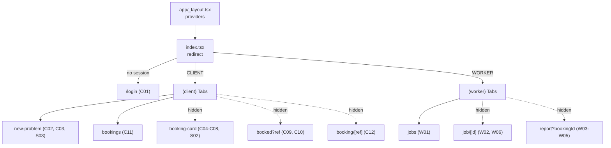
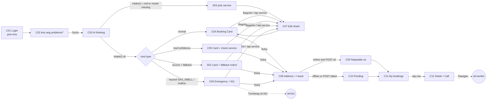
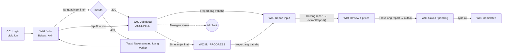
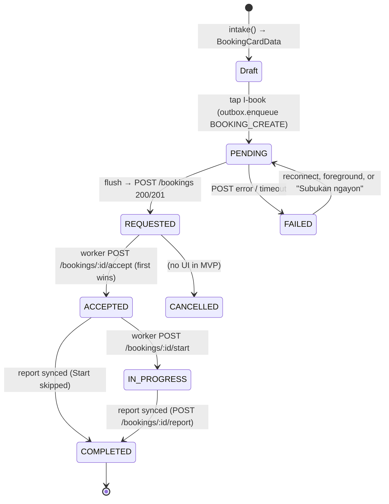
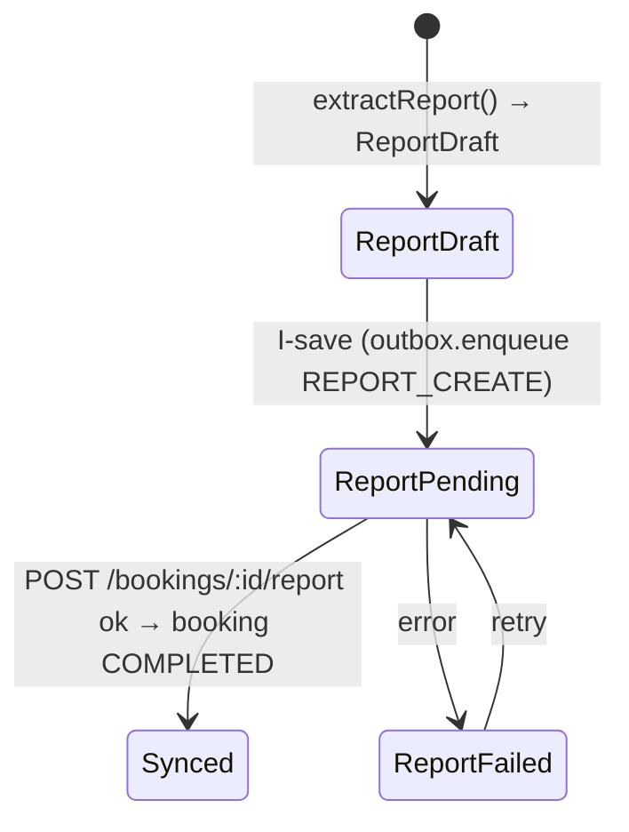

# TrabaWho — FLOWS.md (routes, navigation, states, sync)

**Companion to** `ARCHITECTURE.md` (§4 offline, §6 API, §7 layout) and `DESIGN.md` (screen IDs `C01…`, `W01…`, `S01…`).
Everything here is the **minimum** to ship the demo in SPEC §9. Anything marked *(add)* is not in ARCHITECTURE §7 yet.

---

## 1. Expo Router route map

```
apps/mobile/app/
├─ _layout.tsx                 # fonts, IconContext, ToastProvider, SessionProvider, SyncProvider (NetInfo → flush)
├─ index.tsx                   # (add) redirect: no session → /login; CLIENT → /(client)/new-problem; WORKER → /(worker)/jobs
├─ login.tsx                   # C01 email + password login (signup.tsx: sign-up; profile.tsx; worker/[id].tsx)
├─ (client)/
│  ├─ _layout.tsx              # (add) <Tabs>: new-problem "Bago", bookings "Bookings"; others href:null (hidden)
│  ├─ new-problem.tsx          # C02 input · C03 thinking · S03 model-not-loaded
│  ├─ booking-card.tsx         # C04/C05/C06/S02 card · C07 edit sheet (Modal) · C08 address step
│  ├─ booked.tsx               # (add) C09 sent / C10 pending, param ?ref=<clientRef>
│  ├─ bookings.tsx             # C11 my bookings (cache + outbox rows)
│  └─ booking/[ref].tsx        # (add) C12 detail; ref = clientRef so pending items open too
└─ (worker)/
   ├─ _layout.tsx              # (add) <Tabs>: jobs "Jobs"; others hidden
   ├─ jobs.tsx                 # W01 open jobs + "Akin" segment
   ├─ job/[id].tsx             # W02 detail (Accept / Start / Call / I-report) · W06 completed view
   └─ report.tsx               # W03 input · W04 review · W05 saved; param ?bookingId=<id>
```

Notes

- **Address is a step inside `booking-card.tsx`** (scroll to an address section, or a local `step` state), not a separate route. That keeps the `BookingCardData` + user edits in one component and needs no route params. If the SWE prefers a route, add `(client)/address.tsx` and read the draft from `useIntakeDraft()`.
- **Never pass `BookingCardData` through route params** (it gets stringified). Put it in `useIntakeDraft()` (React context) and navigate with no params.
- "Account" tab in the mockups = a header button "Palitan ang account" → `session.clear()` → `router.replace('/login')`. Make it a tab only if time allows.
- Android back: from `booked` go to `bookings` with `router.replace`, so back doesn't return to a submitted card.



---

## 2. Client navigation



Rules

- **Book always writes to the outbox first** (ARCH 4.2), then tries to flush. The screen shows C09 only if that flush finished with `sent` within ~3 s; otherwise C10. Same code path online and offline.
- The 911 button on C06 never blocks booking: "Ituloy ang booking pag ligtas na" continues to C08.
- Back from C04–C08 to C02 keeps the typed text (keep it in `useIntakeDraft`).

## 3. Worker navigation



Rules

- Accept and Start are **online-only** (disabled with reason when offline, S01 #8). Report is **offline-capable**.
- Cut-list #3 (no Start step): W02 shows "I-report" right after Accept; the report sync sets `COMPLETED` regardless.
- W04 "I-save" is disabled until every material row has a price (0 allowed). Totals come only from `computeReportTotals()`.

---

## 4. Booking status state machine

Server enum: `REQUESTED → ACCEPTED → IN_PROGRESS → COMPLETED` (+ `CANCELLED`, no UI). Local outbox states `PENDING` / `FAILED` exist only on the phone, before the server has the booking.



Report has the same local sub-states on the **worker** phone:



**UI status resolver** (one function, used by every list and badge):

```ts
// src/data/status.ts
type UiStatus = 'PENDING' | 'FAILED' | BookingStatus;
function uiStatus(row: { outbox?: OutboxRow; server?: { status: BookingStatus } }): UiStatus {
  if (row.server) return row.server.status;          // server truth wins once it exists
  if (row.outbox?.status === 'failed') return 'FAILED';
  return 'PENDING';                                    // outbox 'pending' (or 'sent' but cache not refreshed yet)
}
```

A worker's job with a pending report shows `IN_PROGRESS` (or `ACCEPTED`) + a small "Report: Pending" badge until sync.

---

## 5. Offline → online sync sequence

```mermaid
sequenceDiagram
  autonumber
  actor U as User
  participant S as Screen
  participant O as outbox (SQLite)
  participant E as Sync engine
  participant N as NetInfo
  participant A as API (Express)
  participant D as Postgres

  U->>S: Tap I-book (airplane mode ON)
  S->>O: enqueue(BOOKING_CREATE, payload{clientRef=uuid, createdOffline:true})
  S->>E: flush()
  E->>N: online?
  N-->>E: false
  E-->>S: nothing sent
  S-->>U: C10 "Pending: ipapadala pag may internet"
  Note over S: C11 shows row from outbox (dashed Pending badge)

  U->>N: Airplane mode OFF
  N-->>E: isConnected = true (listener)
  E-->>S: OfflineBanner → "Online ulit", toast "Ipinapadala ang 1 item..."
  loop each outbox row (status pending|failed), oldest first
    E->>A: POST /bookings (Bearer token, body = BookingCreate)
    A->>D: insert ... on clientRef unique (return existing if dup)
    D-->>A: Booking{id, status: REQUESTED}
    A-->>E: 201 / 200 Booking
    E->>O: status = sent
    E->>E: upsert bookings_cache
  end
  E-->>S: toast "Naipadala na ang 1 item"; row badge Pending → Hinahanapan (A3)
  loop every 5 s while C11/C12 focused and online
    S->>A: GET /bookings/mine
    A-->>S: bookings[]
    S->>S: upsert cache; StatusTimeline updates when worker accepts
  end
```

Engine rules (from ARCH 4.2, made concrete)

- Triggers: NetInfo change to online, `AppState` → `active`, app start, manual retry, and right after every enqueue.
- One flush at a time (a module-level `isFlushing` flag). Process rows in `createdAt` order; stop the loop on a network error (keep remaining rows `pending`), mark `failed` + `attempts++` on a 4xx/5xx for that row and continue.
- `400` (Zod rejected) is a bug, not a retry: mark `failed`, log it, show the failed row. `409` on report = already completed: treat as sent.
- Never delete outbox rows during the demo; mark `sent`. Hide `sent` rows once the cache has the server record.

---

## 6. Screen → data / API

| ID | Screen | Reads | Writes / calls | Offline |
| --- | --- | --- | --- | --- |
| C01 | Login / Sign-up | `POST /auth/login` or `/auth/signup` → `{ token, user }` | Token in expo-secure-store (kv fallback), user cached in SQLite kv; `Authorization: Bearer` on every call | Needs internet; clear offline message. After login, cached session works offline |
| C02/C03 | New problem / thinking | `aiService` status (`init()` promise) | `aiService.intake(text)` → `BookingCardData \| null`; `setCard()` in draft | Full |
| S03 | Model not loaded | `init()` rejected | Picker → `buildBookingCard({service, task:'<SERVICE>_INSPECT', urgency:'SCHEDULED', hazards: detectHazards(text), summary: text.slice(0,200), confidence:'low'}, 'fallback')` | Full |
| C04–C06, S02 | Booking Card | `useIntakeDraft().card` | none | Full |
| C07 | Edit sheet | `catalog.tasks` filtered by service, `estimateForTask()`, urgency floor from `applyUrgencyFloor()` | draft edits; `editedByUser = true`; re-run `buildBookingCard(edited, card.source)` so price, questions and urgency floor stay in sync | Full |
| C08 | Address + Book | `session.user.city/barangay` (prefill) | `outbox.enqueue('BOOKING_CREATE', BookingCreate)` then `sync.flush()` → `POST /bookings` | Saves as Pending |
| C09/C10 | Booked / Pending | outbox row by `ref` + cache | — | Shows Pending |
| C11 | My bookings | `bookings_cache` ∪ outbox rows (`BOOKING_CREATE`), poll `GET /bookings/mine` 5 s | `sync.retry(id)` on failed rows | Cached + pending |
| C12 | Booking detail | cache row by `clientRef`; poll `GET /bookings/mine` 5 s (no single-booking endpoint) | `Linking.openURL('tel:…')` | Cached; poll paused |
| W01 | Jobs | Bukas: `GET /bookings/open` (poll 5 s); Akin: `GET /bookings/mine` → cache | `POST /bookings/:id/accept` (409 → toast, refetch) | Akin from cache; Bukas shows "Kailangan ng internet" |
| W02 | Job detail | cache row by id (from open or mine) | `POST /bookings/:id/start`; Call | Cached; Accept/Start disabled |
| W03/W04 | Report input / review | booking (task code, service) from cache | `aiService.extractReport(text, taskCode)`; `computeReportTotals()` | Full |
| W05 | Report saved | outbox row | `outbox.enqueue('REPORT_CREATE', ReportCreate)` → flush → `POST /bookings/:id/report` | Saves as Pending |
| W06 | Completed | cache (status `COMPLETED`) + report payload | — | Cached |

**Payloads** are exactly the shared Zod types: `BookingCreate` and `ReportCreate` in `packages/shared/src/schemas.ts`. Set `aiModel = aiService.modelId`, `createdOffline = !online` at enqueue time, `editedByUser` from the edit sheet.

---

## 7. Build order for the SWE (maps to TASKS §3)

1. Tokens, `Text`, `Button`, `Card`, `Badge`, `Header`, `Screen`, icons map (≈1 h). Fonts loaded.
2. Routes + tabs + `index` redirect + login (C01) with stub users.
3. C02 → C03 → C04 with `StubService`; then BookingCard variants (C05, C06, S02) by stubbing different `BookingCardData`.
4. C08 + outbox + C10/C11 Pending rows (the demo's core). Then sync engine + OfflineBanner + toasts (A3–A5).
5. Worker W01 → W02 → W03/W04/W05 with stub `extractReport`.
6. C12 timeline + polling, C07 edit sheet, S01 edge states, then animations A1/A2.
